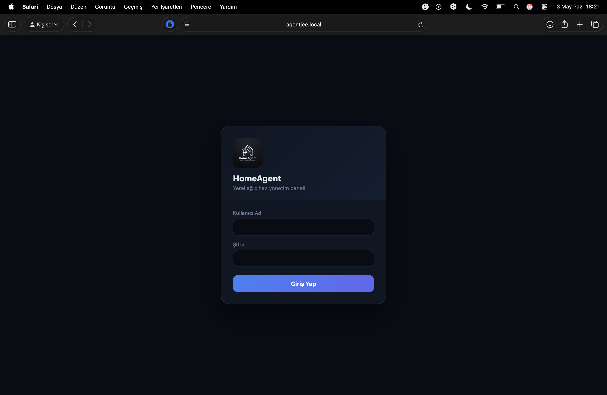
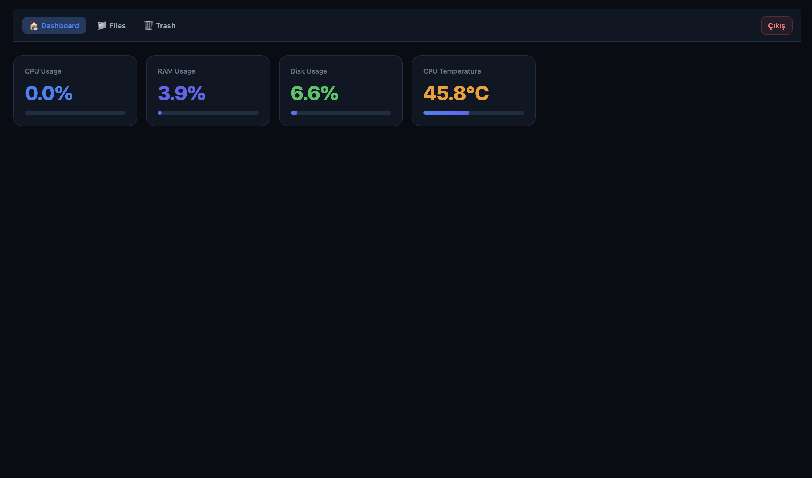
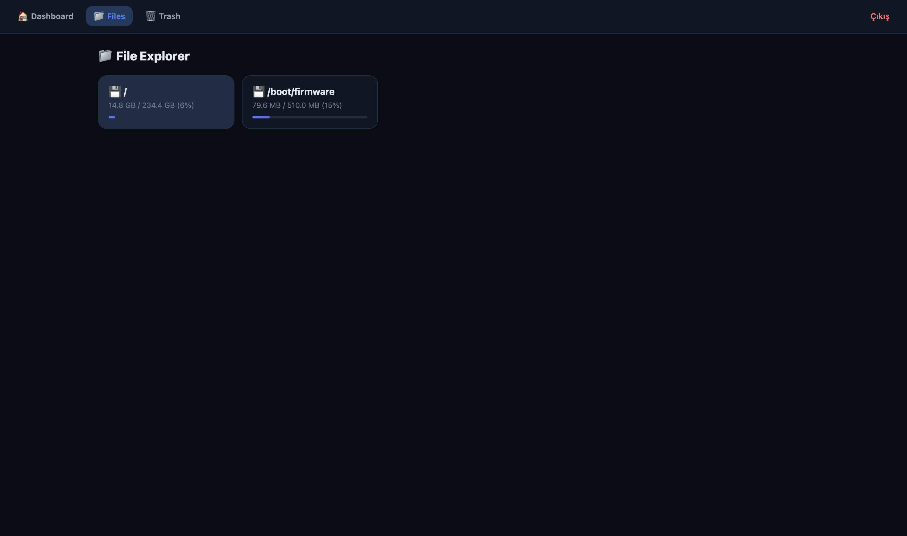
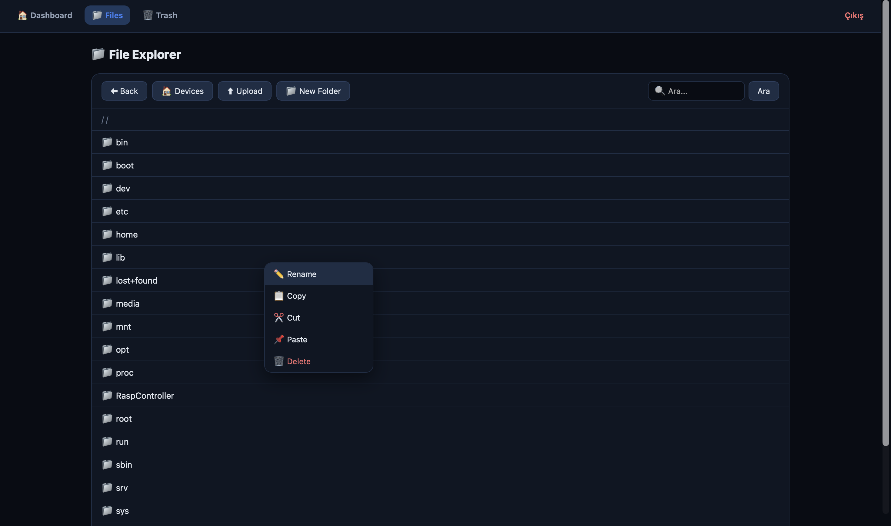
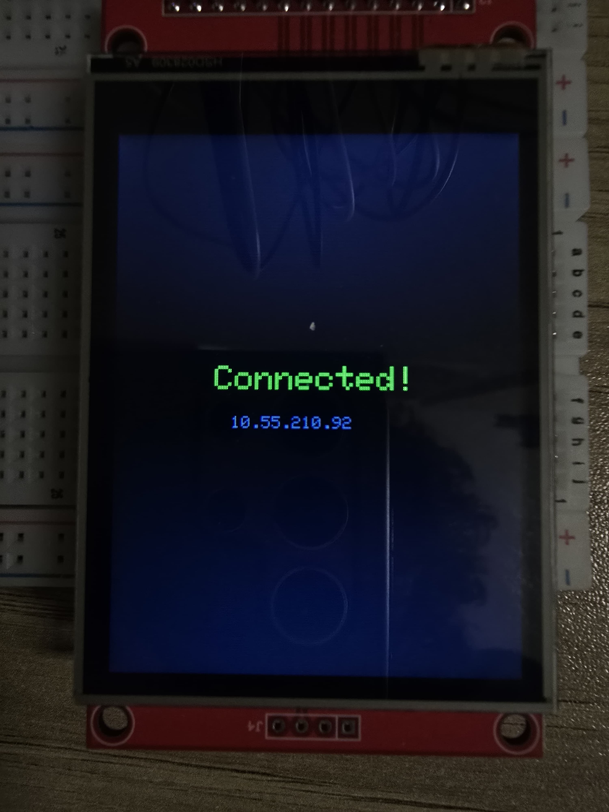
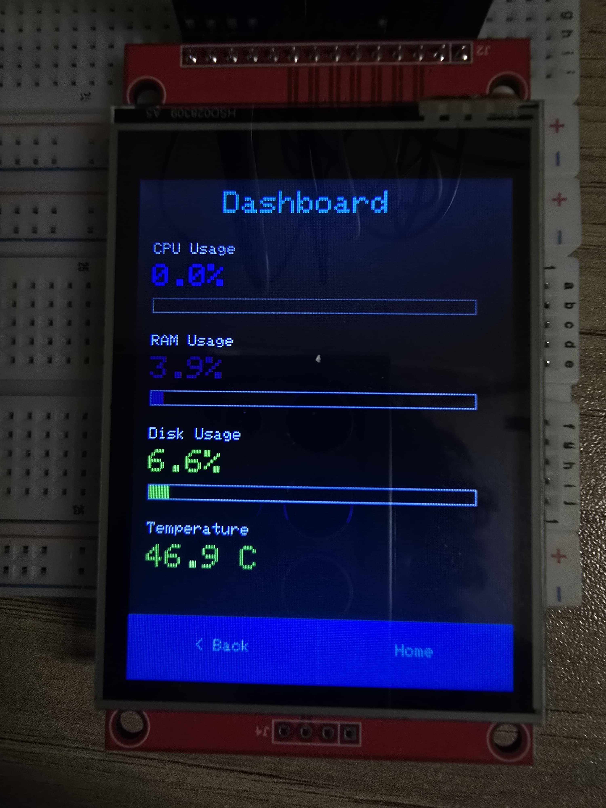
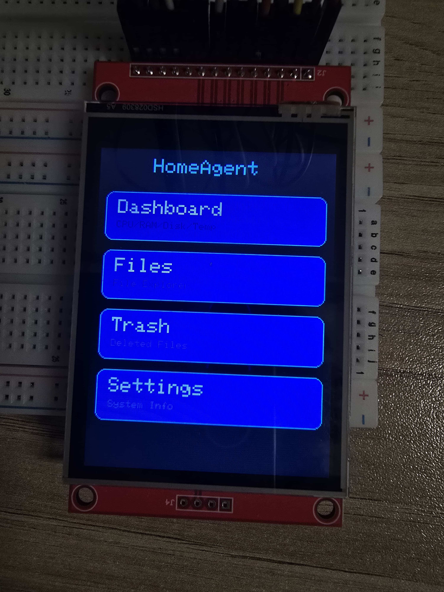
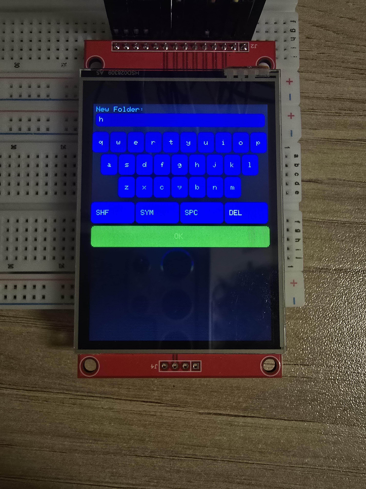
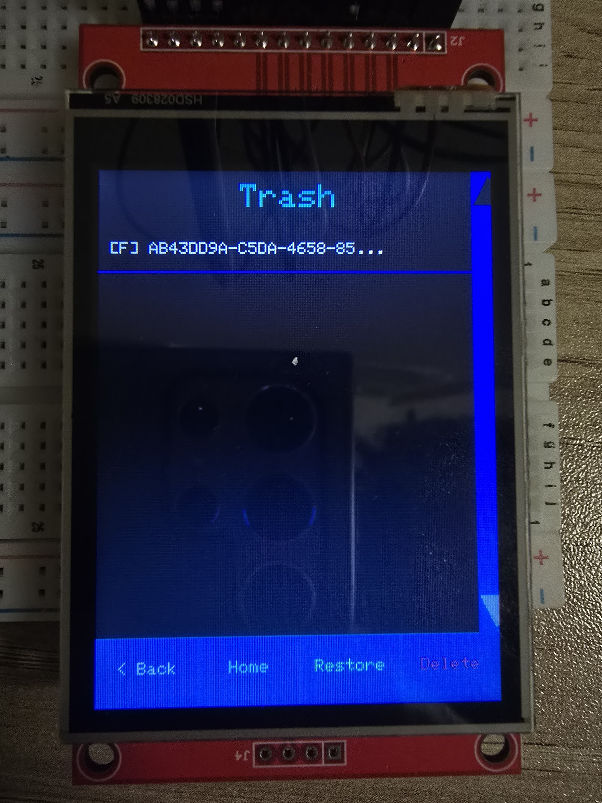
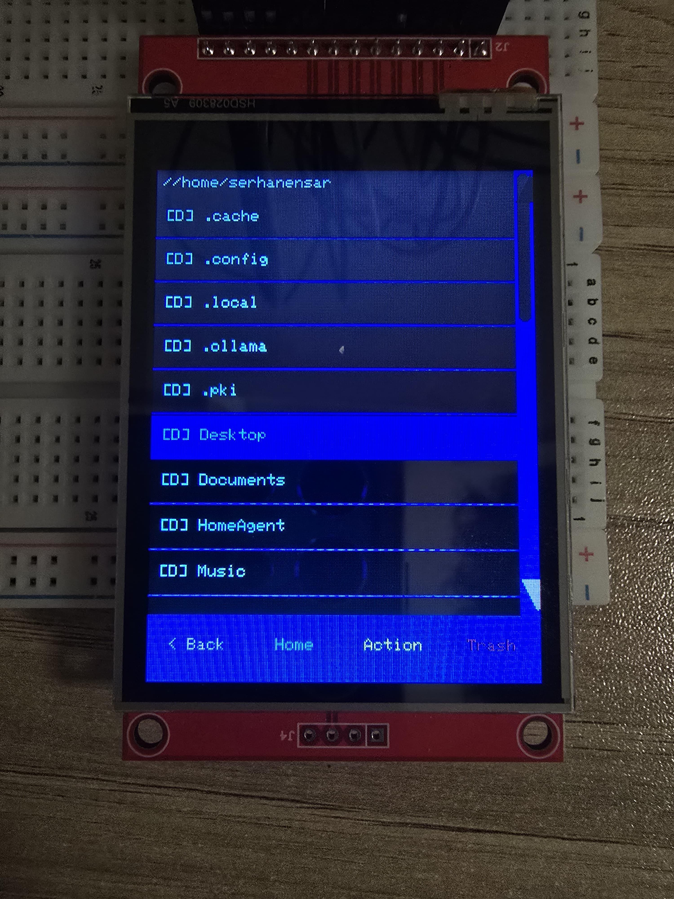

# 🏠 HomeAgent — Raspberry Pi Home Control Panel

HomeAgent is a self-hosted home control system running on a Raspberry Pi. It provides a web-based dashboard, file manager, real-time system stats, and an AI assistant interface — all secured behind session-based authentication.

> **Note:** this repository is a snapshot of an earlier build. The version running now uses JWT auth and Google Gemini 2.5 Flash for the assistant; the code here still has session cookies and a local Mistral 7B via Ollama.

## 📸 Screenshots

<table>
  <tr>
    <td align="center"><b>Login</b></td>
    <td align="center"><b>Dashboard</b></td>
  </tr>
  <tr>
    <td></td>
    <td></td>
  </tr>
  <tr>
    <td align="center"><b>File Explorer — Devices</b></td>
    <td align="center"><b>File Explorer — Context Menu</b></td>
  </tr>
  <tr>
    <td></td>
    <td></td>
  </tr>
</table>

### 🖥️ ESP32 Touchscreen Client

<table>
  <tr>
    <td></td>
    <td></td>
    <td></td>
  </tr>
  <tr>
    <td></td>
    <td></td>
    <td></td>
  </tr>
</table>


- **System Dashboard** — Live CPU, RAM, Disk usage and CPU temperature
- **File Manager** — Browse, rename, download, and delete files directly on the Pi
- **AI Chat** — Conversational assistant powered by a local Mistral 7B model via Ollama
- **Docker Control** — Start/stop Docker containers from the web panel
- **Telegram Bot** — Remote control via Telegram commands (`/status`, `/reboot`, `/shutdown`, etc.)
- **Profile & Settings** — Change password, configure panel refresh rate
- **Trash Management** — Safe file deletion with restore capability

## 🛠 Tech Stack

| Layer | Technology |
|---|---|
| Backend | Python · FastAPI · Uvicorn |
| Templating | Jinja2 · Vanilla JS |
| Auth | Session cookies · `itsdangerous` · PBKDF2-HMAC-SHA256 |
| AI | Ollama · Mistral 7B (local) |
| System | psutil · Docker SDK |
| Bot | Telegram Bot API (polling) |

## 🚀 Getting Started

### Prerequisites

- Raspberry Pi running Linux (ARM)
- Python 3.10+
- Ollama (optional, for AI chat)

### Installation

```bash
git clone https://github.com/serhanensar/HomeAgent.git
cd HomeAgent
python3 -m venv venv
source venv/bin/activate
pip install -r requirements.txt
```

### Configuration

Copy the example environment file and fill in your values:

```bash
cp .env.example .env
```

| Variable | Description |
|---|---|
| `SECRET_KEY` | Session signing secret (generate a random string) |
| `API_KEY` | API key for mobile/ESP32 clients |
| `USERNAME` | Web panel login username |
| `PASSWORD` | Web panel login password |

> ⚠️ **Never commit your `.env` file.** It is already listed in `.gitignore`.

### Running

```bash
source venv/bin/activate
uvicorn app.main:app --host 0.0.0.0 --port 8000 --reload
```

Panel will be available at `http://<PI_IP>:8000`

### Telegram Bot (optional)

```bash
TG_TOKEN=<your_token> TG_CHAT_ID=<your_chat_id> python app/telegram_control.py
```

## 📡 API Endpoints

| Method | Endpoint | Auth | Description |
|---|---|---|---|
| GET | `/api/status` | API Key | CPU, RAM, Disk, Temperature |
| GET | `/api/info` | — | Hostname, IP, Wi-Fi info |
| POST | `/api/chat` | API Key | AI assistant message |
| GET | `/api/docker/containers` | Session | List Docker containers |
| GET | `/api/files/list` | Session | Directory listing |

## 🔒 Security Notes

- Passwords are hashed with PBKDF2-HMAC-SHA256 (200,000 iterations)
- Session secrets and auth hashes are stored in local files excluded from git
- All `/api/*` endpoints require either a valid session cookie or API key
- Change the default password on first login via the Profile page

## 🔗 Related Projects

| Project | Description |
|---|---|
| [HomeAgent-Mobile-K](https://github.com/serhanensar/HomeAgent-Mobile-K) | Android/Tablet app (Jetpack Compose) |
| [HomeAgent_Wear](https://github.com/serhanensar/HomeAgent_Wear) | Wear OS companion app |
| [HomeAgentMobile](https://github.com/serhanensar/HomeAgentMobile) | Cross-platform mobile app (Expo) |

## 👨‍💻 Developer

Created and developed by **[Serhan Ensar](https://github.com/SerhanEnsar)**.

## 📄 License

MIT
